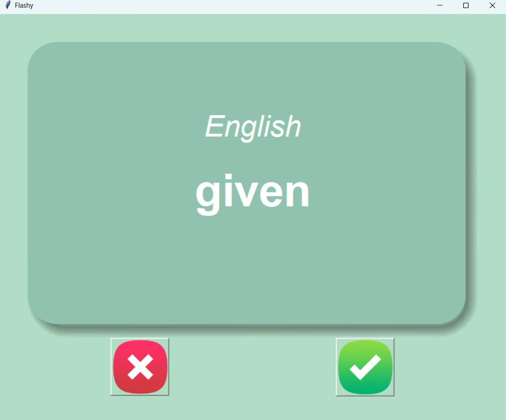
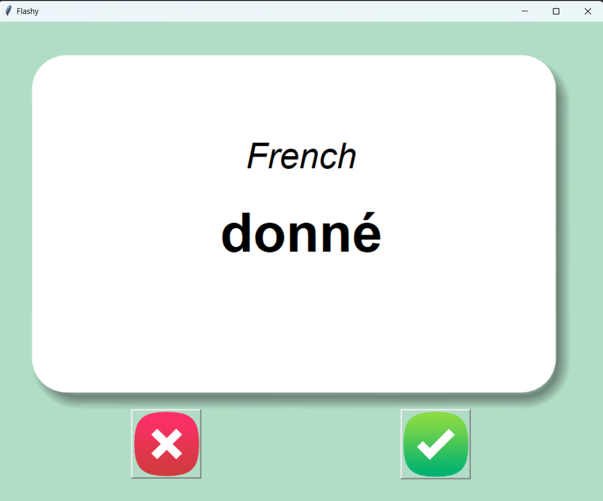

### Flash Card Application 

#### English word

#### French Word

This project is a flash card application that enables Language learners learn a foreign language easily, fully written with python. 

The languages involved are `English` and `French`.

`Tkinter` was used for the Graphical User Interface (GUI)

`Pandas` was used for making dataframe out of the dataset.

`random` library was used for random selecting a word from [French word](https://github.com/Dolamu-TheDataGuy/Flash-Card-App/tree/main/data/french_words.csv)

